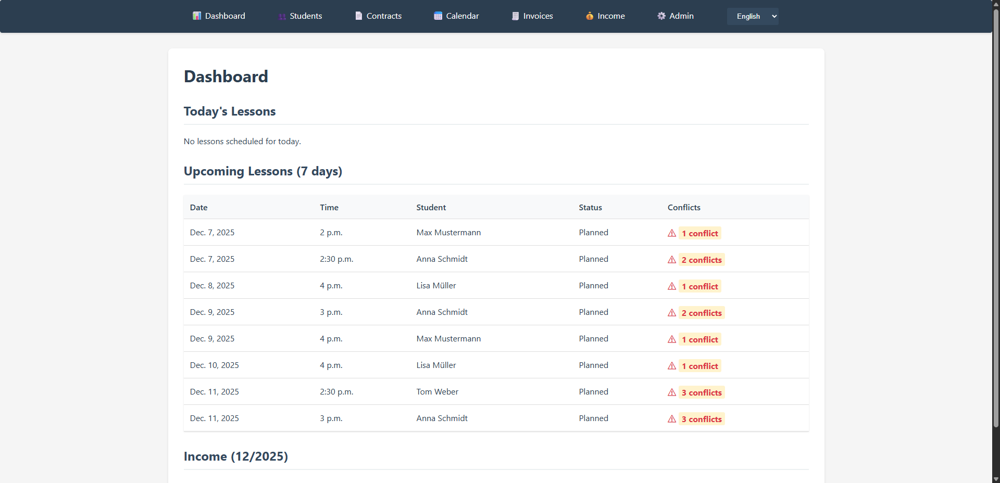
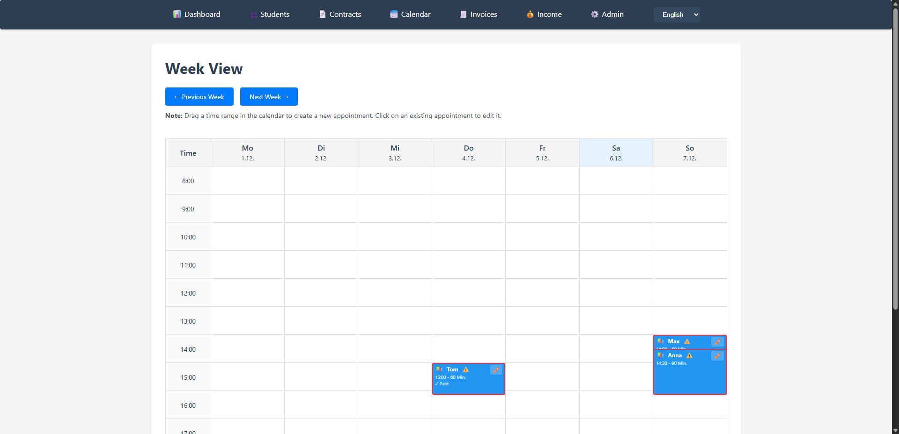
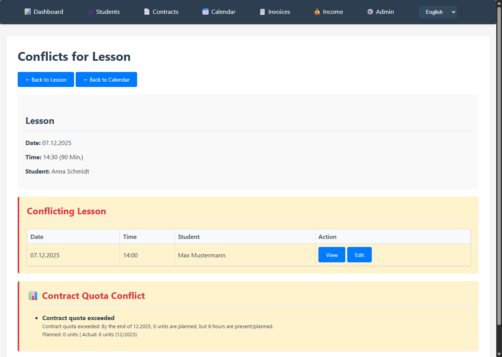
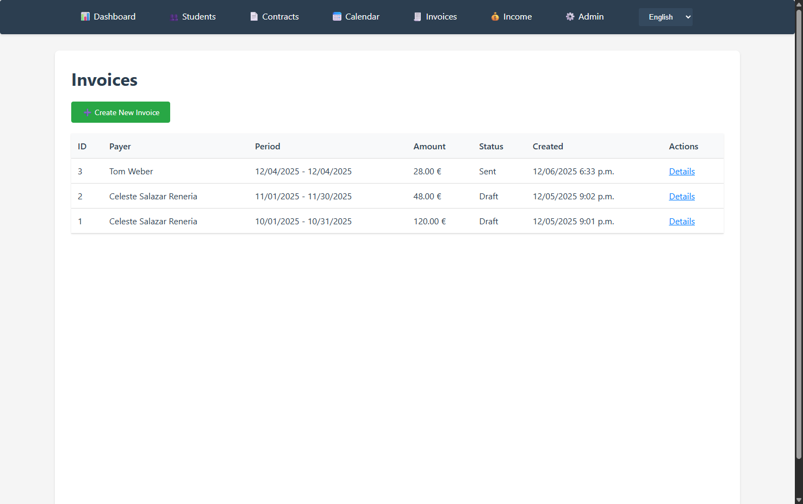

# TutorFlow

[](https://github.com/andreaseirich/tutorflow/actions)
[](https://www.python.org/downloads/)
[](https://www.djangoproject.com/)
[](LICENSE)
[](https://github.com/astral-sh/ruff)
[](docs/ARCHITECTURE.md#internationalization-i18n)

## TL;DR – Demo in 2 commands

```bash
cp .env.example .env
./scripts/run_demo.sh
```

- Starts the backend with `MOCK_LLM=1`, loads deterministic fixtures, and opens `http://127.0.0.1:8000/`.
- Health check: `curl http://127.0.0.1:8000/health/` → `{ "status": "ok" }`
- Browser-free smoke test: `./scripts/smoke_demo.sh` (waits for `/health/`)

**Demo-Logins**

| Rolle            | Benutzername    | Passwort  | Bereich |
| ---------------- | --------------- | --------- | ------- |
| Premium (AI)     | `demo_premium`  | `demo123` | Admin   |
| Standard         | `demo_user`     | `demo123` | Admin   |

## Project Overview

TutorFlow is a comprehensive web application designed for tutors to manage their tutoring business efficiently. It solves the challenge of organizing students, contracts, and lessons while avoiding scheduling conflicts and maintaining clear financial oversight. The application is built for tutors who need a structured, reliable tool to manage their teaching activities, track income, and generate invoices—all with intelligent conflict detection and AI-powered lesson planning support.

## Submission (Teca Hacks)

- **Devpost entry:** Add the final link to the TutorFlow project page on Devpost (include teammates and tech stack).
- **Demo video (recommended):** Short walkthrough (2–3 minutes) focusing on Week View, conflict detection, and AI Lesson Plans.
- **Short description:** 2–3 sentences on problem & solution (e.g., “Tutors avoid double bookings, gain financial clarity, and generate AI-powered lesson plans”).
- **Repository link & deploy note:** GitHub link (this repo) plus a short note on the demo setup (`./scripts/run_demo.sh`, mock LLM).
- **Learnings & challenges:** Summarize the key learnings (e.g., conflict detection, i18n, OpenAI-compatible API design).

## Key Features

- **📅 Intelligent Scheduling**: Interactive week view with click-to-create appointments, automatic conflict detection (time overlaps & contract quotas), and recurring lesson support
- **👥 Student & Contract Management**: Centralized management of students, contracts, and monthly planning with flexible contract structures
- **💰 Billing & Income Tracking**: Automated invoice generation from lessons, monthly/yearly income overviews, and planned vs. actual comparisons
- **🚫 Blocked Time Management**: Personal appointment blocking (vacations, university, etc.) with multi-day and recurring support, fully integrated in calendar
- **🤖 AI-Powered Lesson Plans**: Premium feature for automatic generation of structured lesson plans using LLM APIs (OpenAI-compatible) with automatic retry on rate limits
- **🌍 Full Internationalization**: Complete i18n/l10n support with English (default) and German, including proper date, number, and currency formatting

### Feature Walkthrough in 2 Minuten

1. **Dashboard** (`/`): Heute/kommende Lessons, Konflikt-Widget, Premium-Badge.
2. **Week View** (`/lessons/week/`): Click-to-create lessons/blocked times, conflict badges, click a lesson → edit & AI lesson plan.
3. **Income Overview** (`/income/`): Planned vs. actual revenue, monthly/yearly view.
4. **Billing** (`/billing/invoices/`): Create invoices from taught lessons, review HTML documents.
5. **Lesson Detail** (`/admin/lessons/lesson/<id>/change/`): “Generate AI Lesson Plan” button for premium; view conflict hints.

## Quick Start

### One-Command Demo (Mocked AI, deterministic data)
```bash
cp .env.example .env
./scripts/run_demo.sh
```
- Starts with `MOCK_LLM=1` (no external calls) and loads `fixtures/demo_data.json`
- Health check: `curl http://127.0.0.1:8000/health/` → `{"status": "ok"}`
- Demo logins: `demo_premium` / `demo123`, `demo_user` / `demo123`

### Environment configuration & security
- Set a strong `SECRET_KEY` in your `.env` before running the app; `DEBUG` defaults to `False` when omitted.
- Specify `ALLOWED_HOSTS` (comma-separated) for any non-local deployment to avoid wildcard hosts in production.
- When using Docker Compose, adjust `POSTGRES_*` variables and `DATABASE_URL` in `.env` instead of relying on hard-coded defaults.

For a full manual installation, see the **Setup** section below.

### Demo Login & Quick Tour

**Fast path (recommended):**
```bash
cp .env.example .env
./scripts/run_demo.sh
```
Starts the server, loads deterministic fixtures, and enables `MOCK_LLM=1` so no external calls are made.

**Manual loading:**
```bash
cd backend
python manage.py loaddata fixtures/demo_data.json
python manage.py runserver
```

**Demo Data Includes:**
- 3 students, 2 contracts with different quotas
- 1 overlapping lesson conflict, 1 taught lesson, 1 planned lesson
- Deterministic lesson plan entry generated via Mock LLM
- Premium vs. standard user experience

**Logins:**
- **Premium User:**
  - URL: `http://127.0.0.1:8000/admin/`
  - Username: `demo_premium`
  - Password: `demo123`
- **Standard User:**
  - URL: `http://127.0.0.1:8000/admin/`
  - Username: `demo_user`
  - Password: `demo123`

**Demo Features to Explore:**
- Lesson conflicts: Lessons 1 and 2 overlap (same day/time window)
- Status variety: Lesson 3 is `taught`, Lesson 4 is `planned`
- Lesson plan: Lesson 1 already contains a mock-generated plan
- Health check: `GET /health/` returns `{"status": "ok"}`

**See main features in 2 minutes:**
1. **Dashboard** (`/`): Overview of today's lessons, upcoming appointments, and conflicts
2. **Week View** (`/lessons/week/`): Interactive calendar - click time blocks to create appointments, click to edit
3. **Income Overview** (`/income/`): Monthly/yearly financial tracking with planned vs. actual comparisons
4. **Billing** (`/billing/invoices/`): Create invoices from taught lessons with HTML document generation

## Screenshots & Demo

### Screenshots


*Dashboard showing today's lessons, upcoming appointments, and conflicts*


*Interactive week view with click-to-create functionality for lessons and blocked times*


*Conflict detection and blocked time management in the week view*


*Invoice list and detail view with automatic generation from taught lessons*

### UI & AI Highlights (Best UI/Creativity)

- **Conflict-first calendar:** Week View with red icons/borders for conflicts; blocked times and lessons combined seamlessly.
- **AI lesson plans in-flow:** Triggered from the lesson detail via button; mock LLM enables reproducible demos without external APIs.
- **Demo-ready:** `./scripts/run_demo.sh` starts in under 60 seconds with deterministic data; ideal for video/GIF captures.

### Quick Demo Tour (2 Minutes)

1. **Login**: Use demo credentials (`demo_premium` / `demo123`) to access the admin interface
2. **Dashboard**: View today's lessons, upcoming appointments, and conflicts overview
3. **Week Calendar**: Open `/lessons/week/` to see the interactive calendar
   - Click in a time block to create a new lesson or blocked time
   - Click on a lesson to view/edit details or generate an AI lesson plan
   - Click on conflict icons to see detailed conflict information
4. **Conflict Detection**: Inspect conflicts in the week view or lesson detail pages
5. **AI Lesson Plans** (Premium): Click on a lesson and use "Generate AI Lesson Plan" button
6. **Billing**: Navigate to `/billing/invoices/` to create invoices from taught lessons

### How It Works

TutorFlow follows a simple 3-step workflow:

1. **📅 Scheduling**: Plan lessons via the interactive week view. Click time blocks to create appointments, set up recurring lessons, and block personal time. The system automatically detects scheduling conflicts and contract quota violations.

2. **⚠️ Conflict Detection**: Real-time conflict detection ensures you never double-book. The system checks for:
   - Time overlaps with other lessons (including travel times)
   - Overlaps with blocked times
   - Contract quota violations (planned vs. actual units)

3. **💰 Billing**: Once lessons are marked as "taught", generate invoices automatically. The system calculates amounts based on contract rates and unit durations, creates invoice documents, and tracks income with planned vs. actual comparisons.

## Problem

Tutors need a reliable tool for managing their students, contracts, and lessons. Planning must avoid scheduling conflicts, income must be clearly presented, and management should be structured and traceable.

## Solution

TutorFlow provides a complete solution for managing tutoring activities:

- **Student Management**: Centralized management of students with contact information, school/grade, subjects
- **Contract Management**: Management of contracts with rates, duration, contract period
- **Lesson Planning**: Planning of tutoring lessons with date, time, and travel times
  - **Calendar View**: Central UI for lesson planning - Lessons are primarily planned and edited via the calendar view
  - **Recurring Lessons**: Support for recurring lessons (e.g., every Monday at 2 PM)
- **Blocked Times**: Management of personal appointments and blocked times (e.g., university, job, community)
- **Income Evaluation**: Monthly and yearly evaluations of income by status
- **Automatic Status Management**: Lessons with status 'planned' are automatically set to 'taught' when their end time is in the past. Updates happen automatically when accessing Dashboard, Week View, or Income Overview. Can also be run manually via `python manage.py update_past_lessons`
- **Billing System**: Create invoices from selected lessons with HTML document generation
- **Premium Feature**: AI-powered generation of lesson plans using an LLM API

## Features

### Basic Features
- **Student Management**: Centralized management with contact information, school, subjects
- **Contract Management**: Rates, duration, contract period, planned units
- **Lesson Planning**: Planning with date, time, travel times
  - **Week View**: Interactive week view (Mon-Sun, 08:00-22:00) as central UI for appointment planning
    - **Default calendar view**: Week view is the default calendar view
    - **Click-to-Create**: Click a time block to create a new appointment (tutoring or blocked time)
    - **Recurring option**: When creating a lesson, users can select "Repeat this lesson" with pattern (Weekly/Bi-weekly/Monthly) and weekday selection
    - **Appointment Display**: Lessons (blue), blocked times (orange), conflicts (red border/icon)
    - **Click on Lesson**: Opens lesson plan view (for viewing/creating AI lesson plans)
    - **Click on Edit Icon** (✏️) in lesson block: Opens lesson edit form
    - **Click on Blocked Time**: Opens blocked time edit form
    - **Click on Conflict Icon**: Opens conflict detail view with reasons
  - **Month Calendar**: Alternative view for monthly overview (legacy, redirects to week view)
  - **Recurring Lessons**: Recurring lessons are created exclusively via the lesson creation form in week view (no separate button/page)
  - **Automatic Status Management**: Lesson status (planned/taught) is automatically updated based on time progression. Past planned lessons become 'taught' automatically when views are accessed
- **Blocked Times**: Management of personal appointments (university, job, etc.)
  - **Calendar Integration**: Blocked times are managed exclusively via the calendar (create, edit, display)
  - **Multi-day Blocked Times**: Support for multi-day blocks (e.g., vacation/travel)
  - **Recurring Blocked Times**: Recurring blocked times (e.g., every Tuesday 6-8 PM) with automatic generation
- **Conflict Detection**: Automatic detection of overlaps (including travel times)
  - **Scheduling**: Overlaps with other lessons and blocked times
  - **Contract Quota**: Detection of violations against agreed lesson quota (based on ContractMonthlyPlan)
  - **Conflict Reasons**: Detailed conflict information with type, affected objects, and messages
  - **Automatic Recalculation**: Conflicts are automatically recalculated after any lesson or blocked time change
- **Income Overview**: Monthly and yearly evaluations by status (planned, taught, paid)
- **Dashboard**: Overview of today's/upcoming lessons, conflicts, income
  - **Today section**: Shows all lessons for today (date == today)
  - **Next lessons (7 days)**: Shows lessons from tomorrow up to 7 days in the future (date > today, date <= today + 7)
  - **Separation**: Today's lessons are excluded from "Next lessons" to avoid duplication

### Premium Features
- **AI-powered Lesson Plans**: Automatic generation of detailed lesson plans via LLM API
  - **UI Integration**: Prominent "Generate AI Lesson Plan" button in lesson detail view for premium users
  - **Premium Badge**: Premium status is displayed in the dashboard
  - **Non-Premium Notice**: Non-premium users see a disabled button with a notice about premium availability
- **Human-in-the-Loop**: Generated plans can be adjusted and are accountable

## Tech Stack

### Backend
- **Framework**: Django 6.0
- **Database**: SQLite (development), PostgreSQL (optional for production)
- **Python**: 3.12+
- **Dependencies**: Django, requests (see `requirements.txt`)
- **Internationalization**: Full i18n support with English as default language and German translations

### Premium Features (AI)
- **LLM Integration**: OpenAI-compatible API for AI-generated lesson plans
- **Configuration**: API keys via environment variables. Production model is configurable via `LLM_MODEL_NAME` and defaults to `gpt-3.5-turbo`:
  ```bash
  export LLM_API_KEY="your-api-key"
  export LLM_API_BASE_URL="https://api.openai.com/v1"  # Optional
  export LLM_MODEL_NAME="gpt-3.5-turbo"  # Optional
  ```

### Frontend & Security

**Static Assets & CSP:**
- All JavaScript and CSS are served from static files (`static/js/`, `static/css/`)
- No inline scripts or styles are used in templates (enforced by lint checks)
- Content Security Policy (CSP) is enabled by default to prevent XSS attacks
- CSP can be disabled via `ENABLE_CSP=false` environment variable (not recommended for production)

### Frontend
- Django Templates with minimal JavaScript for the calendar UI

## Setup

### Prerequisites
- Python 3.12 or higher
- pip

### Installation

1. Clone repository:
```bash
git clone <repository-url>
cd tutorflow
```

2. Create and activate virtual environment:
```bash
python3 -m venv venv
source venv/bin/activate  # Linux/Mac
# or
venv\Scripts\activate  # Windows
```

3. Install dependencies:
```bash
pip install -r requirements.txt
```
> Tip: For reproducible builds, you can refresh pins with `uv pip compile` or `pip-compile`.

4. Migrate database:
```bash
cd backend
python manage.py migrate
```

5. Compile translations (for i18n support):
```bash
python manage.py compilemessages
```

6. Start development server:
```bash
python manage.py runserver
```

The application is then available at `http://127.0.0.1:8000/`.

## Security & Deployment Checklist

- Copy `.env` from `.env.example`, then set a strong **SECRET_KEY**; leave `DEBUG` empty for production (→ `False`).
- Set **ALLOWED_HOSTS** to real domains/IPs (no wildcard in prod). Never run production with `DEBUG=True` and empty ALLOWED_HOSTS.
- Configure **DATABASE_URL/POSTGRES_*** for PostgreSQL deployments (Docker Compose supports the env-first setup).
- Run **STATIC_ROOT/collectstatic** for production builds; serve static assets via web server/CDN.
- Set **LLM_API_KEY/LLM_API_BASE_URL** only if you want a real LLM; keep **MOCK_LLM=1** for demos.
- Secure TLS/reverse proxy (e.g., Nginx) forwarding to Gunicorn/Daphne; health check at `/health/`.

### Load Demo Data

Deterministic fixtures (used by `./scripts/run_demo.sh`):

```bash
cd backend
python manage.py loaddata fixtures/demo_data.json
```

Creates:
- 3 demo students with different profiles
- 2 contracts, 1 overlapping lesson conflict, 1 taught lesson, 1 planned lesson
- LessonPlan entry pre-filled from Mock LLM
- Premium vs. standard user for comparison

**Demo Logins (via Admin):**
- `demo_premium` / `demo123` (premium)
- `demo_user` / `demo123` (standard)

**Note:** AI responses are mocked by default (`MOCK_LLM=1`) and PII is sanitized before prompting. Set `LLM_API_KEY` and disable `MOCK_LLM` to use a real LLM.

## Internationalization

TutorFlow supports multiple languages with English as the default language. German translations are available as a secondary language.

- **Default Language**: English (`en`)
- **Supported Languages**: English (`en`), German (`de`)
- **Language Switching**: Available via dropdown in the navigation bar
- **Translation Files**: Located in `backend/locale/`

To update translations:

**Prerequisites for compiling translations:**
- **Linux/macOS**: GNU gettext tools are usually pre-installed. If not:
  - Debian/Ubuntu: `sudo apt-get install gettext`
  - macOS: `brew install gettext`
- **Windows**: Install GNU gettext for Windows:
  1. Download from: https://mlocati.github.io/articles/gettext-iconv-windows.html
  2. Or use Chocolatey: `choco install gettext`
  3. Or use WSL (Windows Subsystem for Linux) for a Linux-like environment
  4. Add the `bin` directory of gettext to your Windows PATH environment variable

```bash
cd backend
python manage.py makemessages -l de
# Edit locale/de/LC_MESSAGES/django.po
python manage.py compilemessages
```

## Project Structure

```
tutorflow/
├── backend/              # Django project
│   ├── apps/            # Feature-specific apps
│   ├── config/          # Project configuration
│   ├── tutorflow/       # Django project configuration
│   └── manage.py
├── docs/                # Documentation
│   ├── ARCHITECTURE.md
│   ├── ETHICS.md
│   ├── PHASES.md
│   ├── CHECKPOINTS.md
│   └── API.md
├── scripts/             # Validation scripts
├── venv/                # Virtual environment
├── requirements.txt
├── README.md
├── CHANGELOG.md
└── cursor_master_prompt.txt
```

## Development

The project is developed in phases. See `docs/PHASES.md` for details.

## Code Style & Linting

TutorFlow uses `ruff` for linting and code formatting. Configuration is in `pyproject.toml`.

### Running Linting

```bash
# Run linting checks
./scripts/lint.sh

# Or manually:
ruff format --check backend/apps backend/tutorflow
ruff check backend/apps backend/tutorflow

# Auto-fix issues:
ruff format backend/apps backend/tutorflow
ruff check --fix backend/apps backend/tutorflow
```

**Recommended**: Run linting before committing to ensure code quality.

## CI & Quality

A GitHub Actions workflow runs checks and tests on each push/pull request:

- Django system check
- Test suite execution
- Code formatting verification
- Linting checks

See the [CI badge](#tutorflow) at the top of this README for the current build status.

**CodeQL code scanning** is configured to detect common security issues in the Python codebase.

## Security

TutorFlow is licensed under the Apache License 2.0 (see [LICENSE](LICENSE) for details).

### Reporting Vulnerabilities

**Security vulnerabilities should be reported privately, not as public GitHub issues.**

For details on how to report vulnerabilities, see [SECURITY.md](SECURITY.md).

- Security issues should be reported via **GitHub Security Advisories** (private advisory) or through the contact methods described in SECURITY.md
- GitHub's security features (Security advisories, Code scanning, Dependabot) are configured and supported
- **Dependabot** is configured to monitor dependencies for security updates (Python packages and GitHub Actions)
- **LLM & Privacy**: Mock mode is enabled by default (`MOCK_LLM=1`), prompts are sanitized (PII redacted) before AI use, and no user prompt logs are persisted in demo mode

## Validation

A validation script is available to check the project:

```bash
./scripts/validate.sh
```

The script performs the following checks:
- Django System Check
- Test Suite
- Check for TODO comments
- Check for debug output
- Documentation check

## Documentation

- **ARCHITECTURE.md**: Architecture overview and technical details
- **ETHICS.md**: Ethical-Christian guidelines and data protection principles
- **PHASES.md**: Overview of development phases
- **CHECKPOINTS.md**: Progress log and checkpoints
- **API.md**: API documentation
- **DEVPOST.md**: Content for Devpost submission

## License

This project is licensed under the Apache License 2.0 – see the [LICENSE](LICENSE) file for details.

Copyright (c) 2025 Andreas Eirich

## Contact

For questions or suggestions, please create an issue in the repository.

