# Architecture – TutorFlow

## Overview

TutorFlow is a Django-based web application structured according to modern best practices. The architecture follows the principle of clear separation of responsibilities and modularity.

## Table of Contents

- [Overview](#overview)
- [Internationalization (i18n)](#internationalization-i18n)
- [Technische Architektur](#technische-architektur)
- [Diagrams](#diagrams)
- [Domain-Modell (Implementiert)](#domain-modell-implementiert)
- [Architekturprinzipien](#architekturprinzipien)
- [Design Decisions & Architecture Rationale](#design-decisions--architecture-rationale)
- [Data Flow](#data-flow)
- [Timezone Handling](#timezone-handling)
- [Security](#security)
- [Extensibility](#extensibility)
- [Database Schema](#database-schema)
- [Status](#status)

## Internationalization (i18n)

TutorFlow is fully internationalized with English as the default language and German as a secondary language.

- **Default Language**: English (`en`)
- **Supported Languages**: English (`en`), German (`de`)
- **Implementation**: All templates use `` and `` tags for translatable strings
- **Models**: All model fields, choices, and verbose names use `gettext_lazy()` for translation
- **Language Switching**: Available via dropdown in the navigation bar
- **Translation Files**: Located in `backend/locale/` with separate `.po` files for each language
- **Status**: All templates including billing, blocked time, and recurring scheduling views are fully internationalized with English as the source language
- **Coverage**: No hard-coded German or English text remains in templates - all UI strings are properly wrapped in translation tags

## Technische Architektur

### Backend

#### Framework
- **Django 5.2.9**: Modern Python web framework
- **SQLite**: Standard database for development
- **PostgreSQL**: Optional, prepared for production

#### Project Structure

```
backend/
├── tutorflow/          # Main project configuration
│   ├── settings.py     # Django settings
│   ├── urls.py         # URL routing
│   ├── wsgi.py         # WSGI configuration
│   └── asgi.py         # ASGI configuration
├── apps/               # Feature-specific Django apps
│   ├── students/       # Student management
│   ├── contracts/      # Contract management
│   ├── lessons/        # Lesson planning
│   ├── blocked_times/  # Blocked time management
│   ├── lesson_plans/   # AI-generated lesson plans
│   └── core/           # Core functionality (User extension, Income-Selector)
├── config/             # Additional configuration files
└── manage.py           # Django management script
```

## Diagrams

### Component Diagram (System Overview)

```mermaid
graph TB
    subgraph "Frontend Layer"
        UI[Web UI<br/>Django Templates]
        WeekView[Week View<br/>Interactive Calendar]
        CalendarView[Month View<br/>Calendar]
    end
    
    subgraph "View Layer"
        StudentViews[Student Views]
        ContractViews[Contract Views]
        LessonViews[Lesson Views]
        BlockedTimeViews[BlockedTime Views]
        BillingViews[Billing Views]
        CoreViews[Core Views<br/>Dashboard, Income]
    end
    
    subgraph "Service Layer"
        LessonConflictService[LessonConflictService<br/>Conflict Detection]
        ContractQuotaService[ContractQuotaService<br/>Quota Validation]
        RecurringLessonService[RecurringLessonService<br/>Recurring Generation]
        RecurringBlockedTimeService[RecurringBlockedTimeService<br/>Recurring Generation]
        InvoiceService[InvoiceService<br/>Invoice Creation]
        CalendarService[CalendarService<br/>Month Data]
        WeekService[WeekService<br/>Week Data]
        IncomeSelector[IncomeSelector<br/>Income Calculation]
        LessonStatusService[LessonStatusService<br/>Status Management]
    end
    
    subgraph "Model Layer"
        Student[Student Model]
        Contract[Contract Model]
        ContractMonthlyPlan[ContractMonthlyPlan Model]
        Lesson[Lesson Model]
        RecurringLesson[RecurringLesson Model]
        BlockedTime[BlockedTime Model]
        RecurringBlockedTime[RecurringBlockedTime Model]
        Invoice[Invoice Model]
        InvoiceItem[InvoiceItem Model]
        LessonPlan[LessonPlan Model]
        UserProfile[UserProfile Model]
    end
    
    subgraph "External"
        Database[(Database<br/>SQLite/PostgreSQL)]
        LLMAPI[LLM API<br/>OpenAI-compatible]
    end
    
    UI --> WeekView
    UI --> CalendarView
    WeekView --> LessonViews
    CalendarView --> LessonViews
    LessonViews --> LessonConflictService
    LessonViews --> ContractQuotaService
    LessonViews --> RecurringLessonService
    LessonViews --> CalendarService
    LessonViews --> WeekService
    LessonViews --> LessonStatusService
    
    StudentViews --> Student
    ContractViews --> Contract
    ContractViews --> ContractMonthlyPlan
    LessonViews --> Lesson
    LessonViews --> RecurringLesson
    BlockedTimeViews --> BlockedTime
    BlockedTimeViews --> RecurringBlockedTime
    BlockedTimeViews --> RecurringBlockedTimeService
    BillingViews --> InvoiceService
    CoreViews --> IncomeSelector
    
    LessonConflictService --> Lesson
    LessonConflictService --> BlockedTime
    LessonConflictService --> ContractQuotaService
    ContractQuotaService --> ContractMonthlyPlan
    RecurringLessonService --> Lesson
    RecurringBlockedTimeService --> BlockedTime
    InvoiceService --> Invoice
    InvoiceService --> InvoiceItem
    InvoiceService --> Lesson
    CalendarService --> Lesson
    CalendarService --> BlockedTime
    WeekService --> Lesson
    WeekService --> BlockedTime
    IncomeSelector --> Lesson
    IncomeSelector --> ContractMonthlyPlan
    LessonStatusService --> Lesson
    
    Student --> Database
    Contract --> Database
    ContractMonthlyPlan --> Database
    Lesson --> Database
    RecurringLesson --> Database
    BlockedTime --> Database
    RecurringBlockedTime --> Database
    Invoice --> Database
    InvoiceItem --> Database
    LessonPlan --> Database
    UserProfile --> Database
    
    LessonPlan --> LLMAPI
```



### Data Model Diagram


### Sequence Diagram for Billing


### Domain Model (Implemented)

Die folgenden Entitäten bilden das Kern-Domain-Modell und sind als Django-Models implementiert:

#### Student (apps.students)
- **Fields**: first_name, last_name, email, phone, school, grade, subjects, notes
- **Relationships**: One-to-Many to Contract
- **Purpose**: Centralized management of students with contact data and school information

#### Contract (apps.contracts)
- **Fields**: student (FK), institute, hourly_rate, unit_duration_minutes, start_date, end_date, is_active, notes
- **Relationships**: Many-to-One to Student, One-to-Many to Lesson, One-to-Many to ContractMonthlyPlan
- **Purpose**: Management of contracts with fee, duration and contract period
- **Note**: Planned units per month are explicitly recorded per month in `ContractMonthlyPlan` (no longer via the old field `planned_units_per_month`).

#### ContractMonthlyPlan (apps.contracts)
- **Fields**: contract (FK), year, month, planned_units
- **Relationships**: Many-to-One to Contract
- **Unique Constraint**: (contract, year, month)
- **Purpose**: Explicit monthly planning of planned units per contract. Allows uneven distribution over the year (e.g., more units during exam periods).
- **Important**: Monthly plans are always generated for the entire contract period (start_date to end_date), regardless of the current date. This enables planning for future contracts as well as recording plans for past periods.

#### Lesson (apps.lessons)
- **Fields**: contract (FK), date, start_time, duration_minutes, status (choices), travel_time_before_minutes, travel_time_after_minutes, notes
- **Status**: 'planned', 'taught', 'cancelled', 'paid'
- **Relationships**: Many-to-One to Contract
- **Purpose**: Planning and management of lessons with status tracking

#### RecurringLesson (apps.lessons.recurring_models)
- **Fields**: contract (FK), start_date, end_date, start_time, duration_minutes, travel_time_before_minutes, travel_time_after_minutes, recurrence_type (weekly/biweekly/monthly), monday-sunday (Boolean), is_active, notes
- **Relationships**: Many-to-One to Contract
- **Purpose**: Template for repeating lessons (recurring lessons). Enables definition of series (e.g., "every Monday at 2 PM") and automatic generation of lessons over a period.
- **Recurrence types**:
  - `weekly`: Weekly - every week on selected weekdays
  - `biweekly`: Every 2 weeks - every second week on selected weekdays
  - `monthly`: Monthly - every month on the same calendar day, if that day is a selected weekday
- **Service**: `RecurringLessonService` generates lessons from RecurringLesson templates based on `recurrence_type`, checks conflicts and skips already existing lessons.
- **UI Integration**: Recurring lessons are created exclusively via the lesson creation form in the week view. There is no separate "Create recurring lesson" button or page. Users select "Repeat this lesson" in the lesson form and configure the recurrence pattern.

#### BlockedTime (apps.blocked_times)
- **Fields**: title, description, start_datetime, end_datetime, is_recurring, recurring_pattern
- **Relationships**: No direct relationships
- **Purpose**: Management of personal appointments/blocked times (e.g., university, job, community)
- **Calendar Integration**: Blocked times are managed exclusively via the calendar (create, edit, display). There is no list view anymore.
- **Multi-day blocked times**: Supported by start_datetime and end_datetime (e.g., vacation/travel)
- **Display**: Visually distinct from lessons (yellow background color) in the calendar

#### RecurringBlockedTime (apps.blocked_times.recurring_models)
- **Fields**: title, description, start_date, end_date, start_time, end_time, recurrence_type (weekly/biweekly/monthly), monday-sunday (Boolean), is_active
- **Relationships**: No direct relationships
- **Purpose**: Template for repeating blocked times (recurring appointments). Enables definition of series (e.g., "every Tuesday 6–8 PM") and automatic generation of BlockedTime entries over a period.
- **Recurrence types**:
  - `weekly`: Weekly - every week on selected weekdays
  - `biweekly`: Every 2 weeks - every second week on selected weekdays
  - `monthly`: Monthly - every month on the same calendar day, if that day is a selected weekday
- **Service**: `RecurringBlockedTimeService` generates BlockedTime entries from RecurringBlockedTime templates based on `recurrence_type`, checks conflicts and skips already existing blocked times.

#### LessonPlan (apps.lesson_plans)
- **Fields**: student (FK), lesson (FK, optional), topic, subject, content, grade_level, duration_minutes, llm_model
- **Relationships**: Many-to-One to Student and Lesson (optional)
- **Purpose**: Storage of AI-generated lesson plans

#### UserProfile (apps.core)
- **Fields**: user (OneToOne), is_premium, premium_since
- **Relationships**: One-to-One to Django User
- **Purpose**: Extension of Django User model with premium flag

#### IncomeSelector (apps.core.selectors)
- **Not a Model**: Service layer for income calculations
- **Methods**: 
  - `get_monthly_income()`: Income for a month based on actual lessons
  - `get_yearly_income()`: Income for a year
  - `get_income_by_status()`: Grouping by status
  - `get_monthly_planned_vs_actual()`: Comparison of planned vs. actual units and income per month
- **Purpose**: Derived monthly/yearly reports without own model. Supports comparison between planned (from ContractMonthlyPlan) and actual (from Lessons) values.

#### LessonStatusService (apps.lessons.status_service)
- **Not a Model**: Service layer for automatic status management of lessons
- **Methods**:
  - `update_status_for_lesson(lesson)`: Updates status based on date/time
    - Past lessons (end_datetime < now) with status PLANNED or empty → TAUGHT
    - Future lessons (start_datetime >= now) without status → PLANNED
    - PAID or CANCELLED are NOT overwritten
    - Saves only if lesson already has Primary Key (otherwise only sets status)
  - `bulk_update_past_lessons()`: Sets all past PLANNED lessons to TAUGHT
- **Purpose**: Automatic status setting when creating/updating lessons
- **Integration**: 
  - Called in LessonCreateView and LessonUpdateView
  - Called in RecurringLessonService.generate_lessons() (before and after saving)
- **Important**: Status is NO LONGER manually selectable in the normal lesson form - only automatically set

#### CalendarService (apps.lessons.calendar_service)
- **Not a Model**: Service layer for monthly calendar view
- **Methods**:
  - `get_calendar_data(year, month)`: Loads lessons and blocked times for a month and groups them by days
- **Purpose**: Provision of data for the monthly calendar view. Groups lessons and blocked times by date and checks conflicts.

#### WeekService (apps.lessons.week_service)
- **Not a Model**: Service layer for week view
- **Methods**:
  - `get_week_data(year, month, day)`: Loads lessons and blocked times for a week (Monday to Sunday) and groups them by days
- **Purpose**: Provision of data for the interactive week view. Automatically determines the week range (Monday to Sunday) based on any given day.
- **Important**: 
  - **Week view is the central UI for appointment planning** - Lessons and blocked times are primarily planned and edited via the week view.
  - **Default calendar view**: Week view is the default calendar view. The old monthly calendar view (`/lessons/calendar/`) redirects to week view for backward compatibility.
  - **Drag-to-Create**: Users can drag time ranges in the weekly grid to create new appointments (lessons or blocked times).
  - **Time axis**: 08:00-22:00 with hourly rows.
  - **Appointment display**: Lessons (blue), blocked times (orange), conflicts (red border/icon).
  - **Click on lesson**: Opens lesson plan view (for viewing/creating AI lesson plans)
  - **Click on edit icon** (✏️) in lesson block: Opens lesson edit form
  - **Click on blocked time**: Opens blocked time edit form (no lesson plan)
  - **Click on conflict icon**: Opens conflict detail view with reasons.

### Architecture Principles

#### Module Separation
- Code files should be short and focused (max. 300–400 lines)
- For larger files: Split into services.py, selectors.py, validators.py
- No "God-Modules" with too many responsibilities

#### Naming Conventions
- **snake_case** for Python functions and variables
- **PascalCase** for classes
- Descriptive names, no abbreviations
- Django apps named by domain (students, contracts, lessons, billing, core)

#### Logging and Error Handling
- Log targeted and sparingly
- No silent errors
- Validate errors as early as possible (form/serializer validation)

## Design Decisions & Architecture Rationale

### Why Service Layer?

TutorFlow uses a service layer (e.g., `LessonConflictService`, `IncomeSelector`, `InvoiceService`) to:

- **Separation of Concerns**: Business logic is separated from views and models, making code more maintainable and testable
- **Reusability**: Services can be used across multiple views, management commands, and API endpoints
- **Testability**: Complex business logic (conflict detection, income calculations) can be tested independently
- **Single Responsibility**: Each service has a clear, focused responsibility (e.g., `ContractQuotaService` only handles quota checks)

### Why i18n + l10n?

TutorFlow is designed for multilingual tutors, particularly in German-speaking regions:

- **Target Audience**: Many tutors work with students from different language backgrounds or operate in multilingual environments
- **Professionalism**: Proper localization (dates, numbers, currency) shows attention to detail and respect for user preferences
- **Scalability**: The i18n/l10n infrastructure allows easy addition of more languages in the future
- **User Experience**: Users can work in their preferred language with familiar formatting conventions

### Why Current Module Structure?

The app structure (`apps.core`, `apps.students`, `apps.contracts`, `apps.lessons`, `apps.billing`, etc.) follows Django best practices:

- **Domain-Driven Design**: Each app represents a clear domain boundary (students, contracts, lessons, billing)
- **Modularity**: Features can be developed, tested, and maintained independently
- **Scalability**: New features can be added as new apps or extended within existing apps
- **Clear Dependencies**: The structure makes dependencies between modules explicit (e.g., `lessons` depends on `contracts`, which depends on `students`)

### Code Organization Patterns

**Scheduling Flow:**
- **Views**: `apps.lessons.views` (WeekView, CalendarView, LessonCreateView)
- **Services**: `apps.lessons.services` (LessonConflictService, LessonQueryService)
- **Templates**: `apps.lessons.templates.lessons` (week.html, calendar.html, lesson_form.html)
- **Models**: `apps.lessons.models` (Lesson, RecurringLesson)

**Billing Flow:**
- **Views**: `apps.billing.views` (InvoiceCreateView, InvoiceDetailView)
- **Services**: `apps.billing.services` (InvoiceService)
- **Templates**: `apps.billing.templates.billing` (invoice_create.html, invoice_detail.html, invoice_document.html)
- **Models**: `apps.billing.models` (Invoice, InvoiceItem)

**Income Calculation:**
- **Service**: `apps.core.selectors.IncomeSelector` (no model, pure calculation logic)
- **Views**: `apps.core.views.IncomeOverviewView`
- **Templates**: `apps.core.templates.core.income_overview.html`

This structure makes it easy to find related code: if you're working on scheduling, you know to look in `apps.lessons`; if you're working on billing, you look in `apps.billing`.

## Data Flow

### Planning a Lesson
1. **Week View as central UI**: User opens week view (default calendar view)
2. **Create**: Drag time range in week view or click on time slot → Form with pre-filled date/time
   - User selects student/contract, time, travel times
   - **Recurring option**: Checkbox "Repeat this lesson" with pattern selection (Weekly/Bi-weekly/Monthly) and weekday selection
   - If recurring: Creates RecurringLesson and generates all lessons automatically
   - If not recurring: Creates single lesson
   - Blocked times can also be created via drag-to-create (🚫 symbol)
3. **View Lesson Plan**: Click on lesson block in week view → Opens lesson plan view
   - Shows existing lesson plans (if any)
   - Premium users can generate AI lesson plans
   - Non-premium users see premium notice
4. **Edit Lesson**: Click on edit icon (✏️) in lesson block → Opens lesson edit form (date, time, contract, etc.)
5. **Edit Blocked Time**: Click on blocked time block → Opens blocked time edit form
4. **Recurring lessons**: Recurring lessons are created exclusively via the lesson creation form in week view
   - No separate "Create recurring lesson" button or page
   - After saving: Automatic generation of all lessons in the period
5. System checks conflicts (blocked times, other lessons) including travel times
6. **Conflict detection**: 
   - Calculation of total time block: `start = start_time - travel_before`, `end = start_time + duration + travel_after`
   - Check for overlap with other lessons (including their travel times)
   - Check for overlap with blocked times
   - Check for contract quota violations (planned vs. actual units)
   - Conflicts are displayed with detailed reasons (type, affected objects, messages)
   - **Conflict recalculation**: After any lesson or blocked time change, conflicts are automatically recalculated for all affected lessons
7. Lesson is created (without manual status selection in form)
8. **Automatic status setting**: `LessonStatusService.update_status_for_lesson()`
   - Past lessons → Status TAUGHT
   - Future lessons → Status PLANNED
   - PAID/CANCELLED are not overwritten
   - Applied both for manual creation and Recurring Lessons
9. On completion: Status changes to "taught" → "paid" (via billing system)
10. **Week view shows all lessons**: Past and future lessons are displayed in the week view
    - Past lessons are visually grayed out but clickable
    - All lessons are editable
    - Conflict icons are clickable and link to conflict detail view
11. **Week view date synchronization**: 
    - WeekView uses year/month/day from URL parameters
    - Default date in Create form corresponds to clicked day/time slot
    - Redirect after Create/Update leads back to correct week (year/month/day from request)
12. **Legacy calendar view**: The old `/lessons/calendar/` view redirects to week view for backward compatibility

### Billing Workflow
1. **Select period**: User selects period (period_start, period_end) and optionally contract
2. **Automatic selection**: System automatically selects all lessons with status TAUGHT in the period
   - Lessons with status PLANNED or PAID are not considered
   - Lessons that are already in an invoice are excluded
   - A lesson can only appear in one invoice (1:1 relationship via invoice_items)
3. **Preview**: System shows preview of available lessons (optional)
4. **Create invoice**: `InvoiceService.create_invoice_from_lessons()`
   - Creates Invoice with period_start, period_end, payer_info
   - Creates InvoiceItems for all available TAUGHT lessons in the period (with copy of data)
   - **Calculation**: `units = lesson_duration_minutes / contract_unit_duration_minutes`, `amount = units * hourly_rate`
   - Calculates total_amount as sum of all InvoiceItems
   - Automatically marks all lessons as "paid" (Status TAUGHT → PAID)
5. **Invoice document**: Optional: Generation of HTML/PDF document
6. **Delete invoice**: `Invoice.delete()` (overridden) or `InvoiceService.delete_invoice()`
   - The `delete()` method of the Invoice model is overridden to automatically reset all lessons with status PAID to TAUGHT
   - Works both with direct `invoice.delete()` and via `InvoiceService.delete_invoice()`
   - Deletes Invoice and all InvoiceItems (CASCADE)
   - Resets all associated lessons to TAUGHT (PAID → TAUGHT)
7. **Bulk reset of paid lessons**: Management command `reset_paid_lessons`
   - Resets all lessons with status PAID to TAUGHT
   - Option `--delete-invoices`: Also deletes associated invoices
   - Option `--dry-run`: Only shows what would be changed
   - Usage: `python manage.py reset_paid_lessons [--delete-invoices] [--dry-run]`
8. **Financial view**: Distinction between billed and unbilled lessons

### Conflict Logic (Phase 3)
- **LessonConflictService**: Central service class for conflict detection
- **Time block calculation**: Considers travel times before and after the lesson
- **Conflict types**:
  - `lesson`: Overlap with other lessons
  - `blocked_time`: Overlap with blocked times
  - `quota`: Contract quota exceeded (see below)
- **Conflict marking**: Lessons have `has_conflicts` property and `get_conflicts()` method
- **UI display**: Conflicts are displayed with detailed reasons (type, affected objects, messages) in lesson detail view
  - Conflict icons in week view are clickable and link to conflict detail view
  - Each conflict shows its type and affected lesson/blocked time with links to edit
- **Conflict recalculation**: 
  - After any lesson update: `recalculate_conflicts_for_affected_lessons()` is called to update conflicts for all lessons on the same date
  - After any blocked time create/update/delete: `recalculate_conflicts_for_blocked_time()` is called to update conflicts for all affected lessons
  - Conflicts are automatically recalculated when lessons or blocked times are changed via views

### Contract Quota & Quota Conflicts
- **ContractQuotaService**: Service for checking contract quotas based on ContractMonthlyPlan
- **Rule**: One may not "work ahead" during a contract period
- **Check**: For each month M:
  - Sum of actually held/planned lessons from contract start to end of month M
  - must NOT exceed the sum of planned units (ContractMonthlyPlan) from contract start to month M
- **Catch-up allowed**: If fewer than planned occurred in earlier months, catch-up is allowed
- **Status consideration**: Only lessons with status PLANNED, TAUGHT or PAID are counted (CANCELLED not)
- **Integration**: Quota conflicts are automatically checked in `LessonConflictService.check_conflicts()` and returned as conflict type `quota`
- **UI display**: Quota conflicts are displayed in the lesson detail view with special warning

### Income Calculation (Phase 3)
1. System collects all lessons for a month/year (filterable by status)
2. **IncomeSelector**: Service layer for income calculations
   - `get_monthly_income()`: Monthly income by status
   - `get_yearly_income()`: Yearly income with monthly breakdown
   - `get_income_by_status()`: Grouping by status (planned, taught, paid)
3. Calculation based on contract fee × duration (in hours)
4. Aggregation by status and month
5. Display in IncomeOverview view with filtering by year/month

### AI Lesson Plan Generation (Premium) - Phase 4
1. Premium user views a lesson detail page
2. **Premium check**: System checks if user has premium access (`apps.core.utils.is_premium_user()`)
3. **UI visibility**: 
   - Premium users see a prominent "Generate AI Lesson Plan" button in the lesson detail view
   - Non-premium users see a disabled button with a notice that AI lesson plans are only available for premium users
   - Premium badge is displayed in the dashboard for premium users
4. **Context collection**: System collects relevant information:
   - Student: Name, grade, subject, notes
   - Lesson: Date, duration, status, notes
   - Previous lessons: Last 5 lessons for context
5. **Prompt building**: `apps.ai.prompts.build_lesson_plan_prompt()` creates structured prompt
6. **LLM call**: `apps.ai.client.LLMClient` communicates with LLM API (OpenAI-compatible)
7. **Error handling**: Timeouts, network and API errors are handled cleanly
7. **Storage**: Result is stored as `LessonPlan` with:
   - Link to Lesson and Student
   - Generated content (Markdown text)
   - Metadata (model name, creation timestamp)
8. **UI display**: LessonPlan is displayed in lesson detail view
9. **Human-in-the-Loop**: Tutor reviews and adjusts the plan

### AI Architecture (Phase 4)
- **apps.ai.client.LLMClient**: Low-level API communication
  - OpenAI-compatible format
  - Timeout handling
  - Error handling (LLMClientError)
- **apps.ai.prompts**: Prompt building
  - Structured system and user prompts
  - Context aggregation
- **apps.ai.services.LessonPlanService**: High-level service
  - Orchestrates context collection, prompt building and LLM call
  - Creates/updates LessonPlan model
- **Configuration**: LLM settings via environment variables (LLM_API_KEY, LLM_API_BASE_URL, LLM_MODEL_NAME)

## Timezone Handling

- **Timezone**: Europe/Berlin (according to Master Prompt)
- Django is configured with `TIME_ZONE = 'Europe/Berlin'` and `USE_TZ = True`
- All timestamps, dates and log entries use the timezone Europe/Berlin
- Models with DateTimeField use Django's timezone-aware datetime fields
- Admin interfaces and tests correctly consider the timezone

## Security

- Django standard security features enabled
- CSRF protection
- Authentication via Django auth system
- Validation of all inputs
- No direct SQL queries (use ORM)

## Extensibility

The architecture is designed to be easily extended:

- New apps can be added in `backend/apps/`
- Services can be organized in separate modules
- API endpoints can be added incrementally
- Frontend can be integrated later (Django templates, HTMX, React, etc.)

## Database Schema

### Relationships
- **Student** ← (1:N) → **Contract**
- **Contract** ← (1:N) → **Lesson**
- **Student** ← (1:N) → **LessonPlan**
- **Lesson** ← (1:N) → **LessonPlan** (optional)
- **User** ← (1:1) → **UserProfile**

### Indexes
- Lesson: Index on (date, start_time) and status for performant queries
- BlockedTime: Index on (start_datetime, end_datetime) for conflict detection

### Removed Features
- **Location App**: The entire Location app was removed. Lesson location fields were removed from all models (Lesson, RecurringLesson, Student).
- **Blocked times list view**: Blocked times are managed exclusively via the calendar. There is no separate list view anymore.

## Status

**Phase 2**: Domain models implemented, migrations created and executed, tests written.

- All 7 domain models are implemented
- Migrations successfully executed
- 14 unit tests run successfully
- IncomeSelector implemented as service layer

